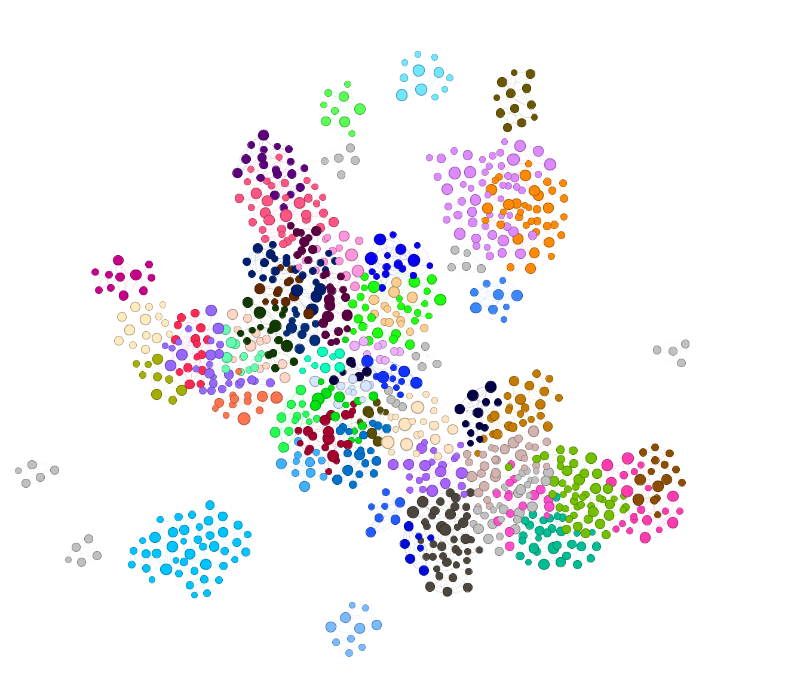

# PixPlot Network Export Tool

This tool extracts image relationships from PixPlot visualizations and exports them as CSV files that can be imported into Gephi for network analysis of visual influence patterns.

## Features

- Extracts nearest-neighbor relationships between images based on the UMAP layout
- Creates a network dataset with weighted edges between visually similar images
- Includes metadata from the original PixPlot visualization
- Generates both nodes and edges CSV files for direct import into Gephi



_1000 images from Oslo, coloured by modularity, sized by eigenvector centrality_

Inspired by the [work of Arnold & Tilton](https://distantviewing.org/)

## Installation

1. Get the script:
```
pixplot_network_export.py
```

2. Requirements:
- Python 3.6+
- NumPy
- SciPy

Install requirements:
```bash
pip install numpy scipy
```

## Usage

Use pixplot on your folder of files. Then:

```bash
python pixplot_network_export.py --data_dir path/to/pixplot/output --n_neighbors 10 --output network.csv --include_thumbs --include_metadata
```

### Arguments

- `--data_dir`: Directory containing PixPlot output (with manifest.json, imagelists, thumbs, etc.)
- `--n_neighbors`: Number of nearest neighbors to find for each image (default: 10)
- `--output`: Output CSV file path for the edges file (default: pixplot_network.csv)
- `--layout`: Layout to use for finding neighbors (default: umap)
- `--include_thumbs`: Include thumbnail paths in output
- `--include_metadata`: Include all available metadata in output

## Importing to Gephi

1. Start Gephi and create a new project
2. Import the nodes file:
   - In Gephi, go to Data Laboratory > Import Spreadsheet
   - Select the `_nodes.csv` file
   - Choose "Nodes table" as the import type
   - Configure the import settings as needed

3. Import the edges file:
   - In Gephi, go to Data Laboratory > Import Spreadsheet
   - Select the main CSV file created by the script
   - Choose "Edges table" as the import type
   - Make sure "Append to existing workspace" is selected
   - Select "source" and "target" as the source and target columns
   - Select "weight" as the weight column

4. Visualize the network:
   - Go to Overview
   - Apply a layout algorithm (ForceAtlas2 works well)
   - Adjust node size based on degree or other metrics
   - Adjust edge thickness based on weight

## Understanding the Output

The script creates two CSV files:

1. **Edges file** (`network.csv`): Contains information about relationships between images with columns:
   - `source`: The source image filename
   - `target`: The target image filename (neighbor)
   - `weight`: The strength of the relationship (inverse of distance)
   - `distance`: The distance between images in the layout
   - `rank`: The neighbor rank (1 = closest neighbor)
   - Position data for visualization
   - Metadata from the source image (if available)

2. **Nodes file** (`network_nodes.csv`): Contains information about each unique image with columns:
   - `id`: The image filename
   - `x`, `y`: Coordinates in the layout
   - Metadata from the image (if available)

## Troubleshooting

- If the script can't find layout files, try different `--layout` options (umap, tsne, rasterfairy)
- If you have issues with file paths, check the structure of your PixPlot output directory

## License

MIT License
